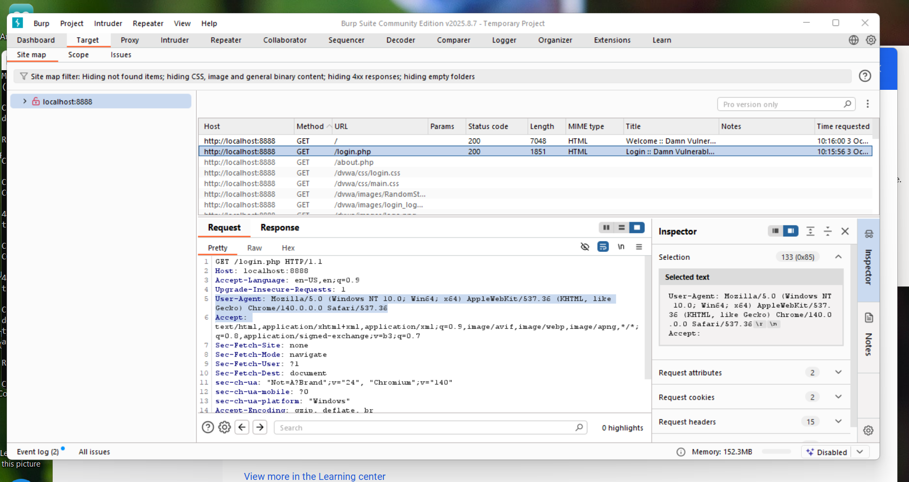
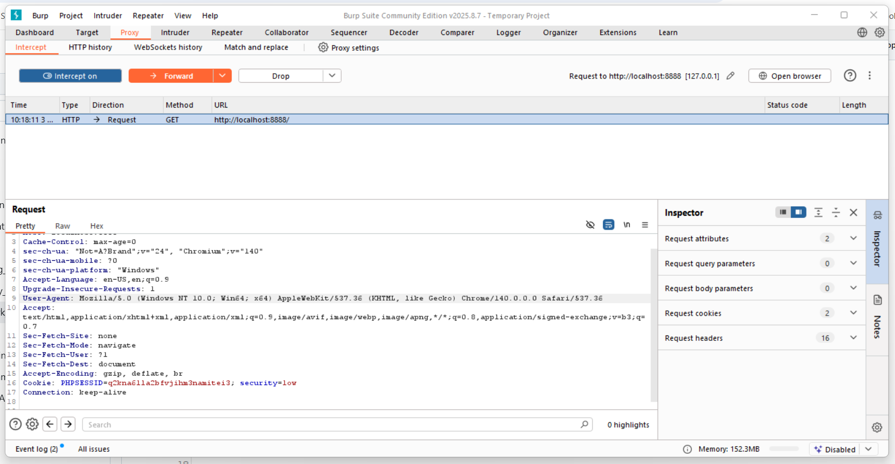
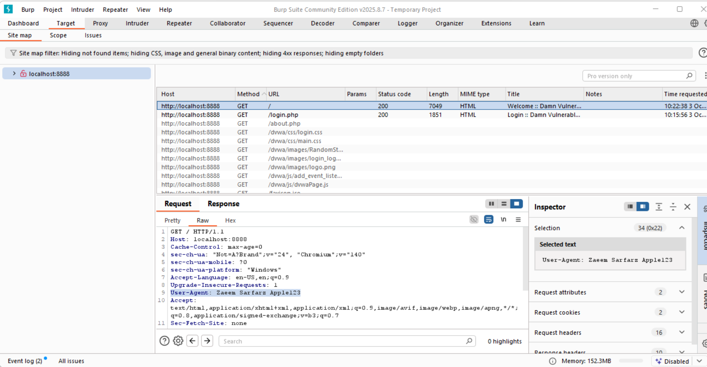
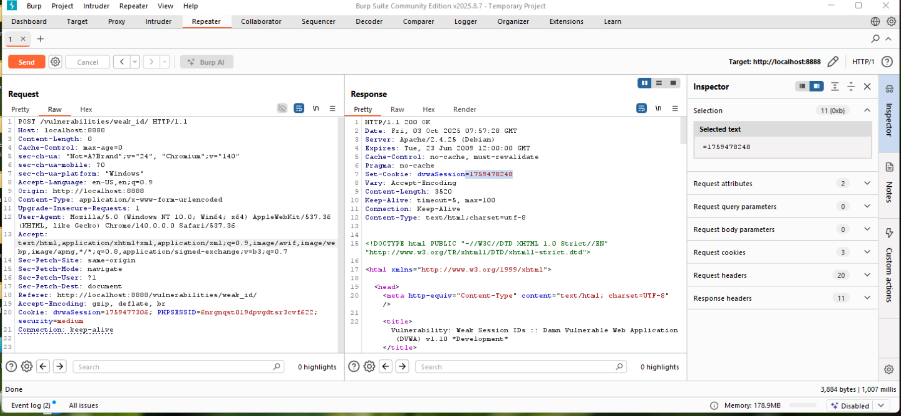
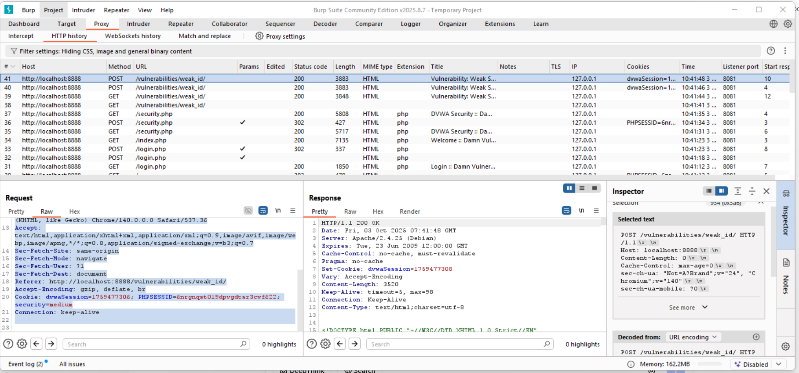
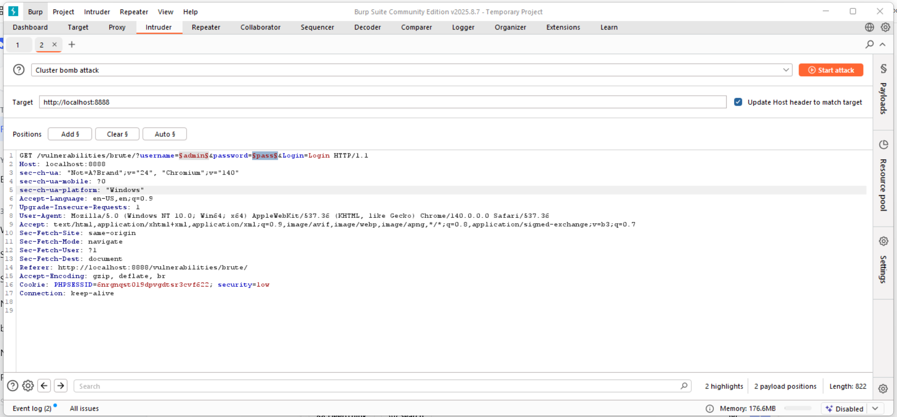
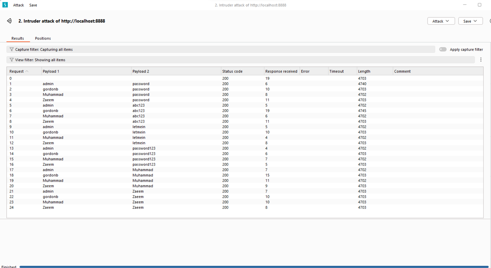
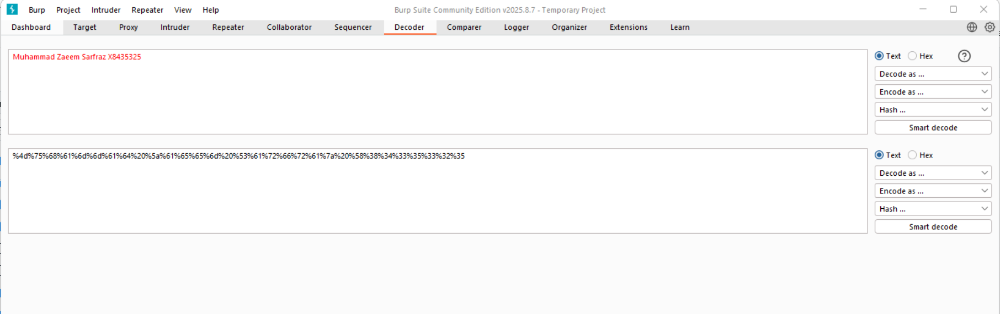
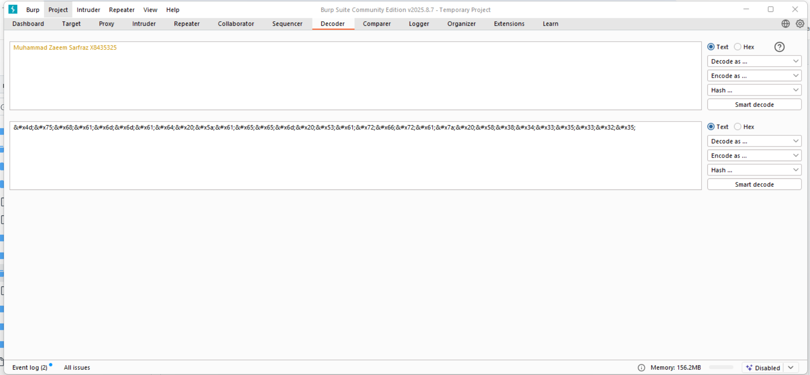

# Week 4 Exercise - Security Engineering

**Student:** Muhammad Zaeem Sarfraz  
**University:** University of Vaasa  
**Course:** Security Engineering IC00AJ63-3003  
**Student No:** x8435325  

---

## Task 1: Side-Channels

**Side-Channel Attack: Cache Timing Attack**

**What side-channel the attack uses and how:**
Cache timing attacks exploit timing differences in CPU cache access. The attacker measures how long memory accesses take to determine whether data is in the cache (fast access) or must be fetched from main memory (slow access).

**What systems does it affect:**
This affects virtually all modern computers with CPU caches, including cloud servers, personal computers, and mobile devices.

**What information is leaked:**
The attack can reveal cryptographic keys, passwords, and other sensitive data by observing cache access patterns during cryptographic operations.

**Real-life documented case:**
In 2016, researchers demonstrated a cache timing attack called "CacheBleed" that could extract RSA keys from OpenSSL implementations.

**Has it been fixed:**
Partially. Mitigations include constant-time programming, cache flushing, and hardware modifications, but complete protection remains challenging.

**Sources:**
- https://web.eecs.umich.edu/~genkin/cachebleed/index.html
- https://cass-kul.github.io/exercises/7-cache/

---

## Task 2: Slow Loris

**How does it work:**
Slow Loris maintains multiple partial HTTP connections to a web server by sending headers slowly, keeping connections open without completing requests, eventually exhausting the server's connection pool.

**Why unique compared to high bandwidth DDoS:**
It requires minimal bandwidth (can run from a single machine) and targets application layer resources rather than network bandwidth, making it harder to detect and mitigate.

**Effects of the attack:**
Server becomes unable to accept new legitimate connections, causing service denial while appearing to function normally to monitoring systems.

**Mitigation/prevention:**
- Configure lower timeout values
- Limit connections per IP address
- Use load balancers with connection limiting
- Implement web application firewalls

**Notable instances:**
Used in 2009 against Iranian government websites during elections and various other political and commercial targets.

**Sources:**
- https://en.wikipedia.org/wiki/Slowloris_(cyber_attack)

---

## Task 3: BurpSuite & THC-Hydra

### Subtask 1: Intercepting
**Evidence:** The screenshot shows successful interception and modification of User-Agent header to "Zaeem Sarfarz Apple123" demonstrating the ability to manipulate HTTP requests in transit.

### Subtask 2: Repeater
**Explanation:** "The dvwaSession cookie is generated using UNIX timestamps, increasing predictably with each request (e.g., 1759477306, 1759477673, 1759478163). This represents a serious security vulnerability as session identifiers should be cryptographically random and unpredictable, not based on easily guessable time values."

### Subtask 3: Intruder
**Analysis:** "No bruteforce attempts were successful. All 24 attempts returned HTTP 200 status with identical response lengths (4703 bytes), indicating uniform login failures. Evidence includes consistent error patterns across all username/password combinations tested."

### Subtask 4: Decoder
**Evidence:** Screenshots demonstrate encoding/decoding functionality with the text "Muhammad Zaeem Sarfraz  X8435325 " showing URL encoding, HTML encoding, and smart decode operations.

### Subtask 5: thc-hydra
**Status:** This task was not completed due to workload and couldn't be finalized within the available timeframe.

---
